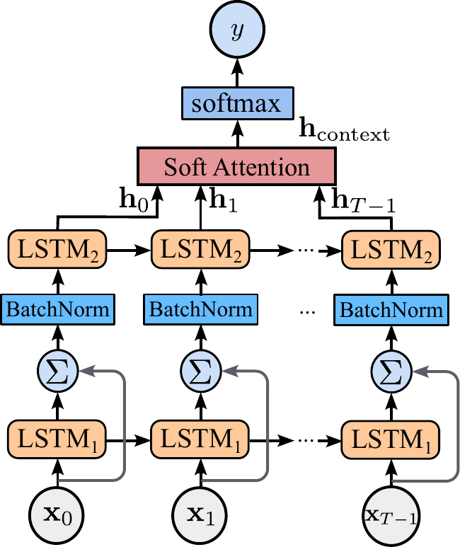
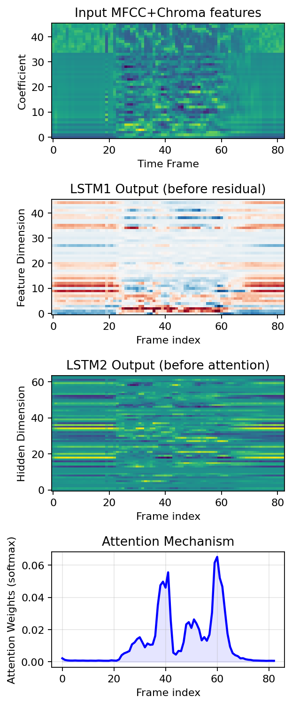
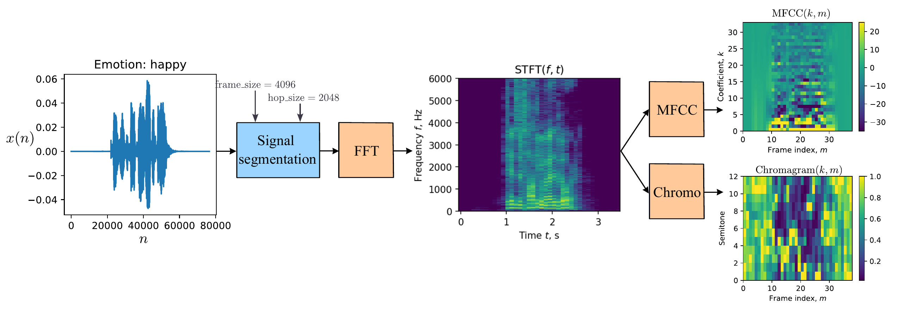
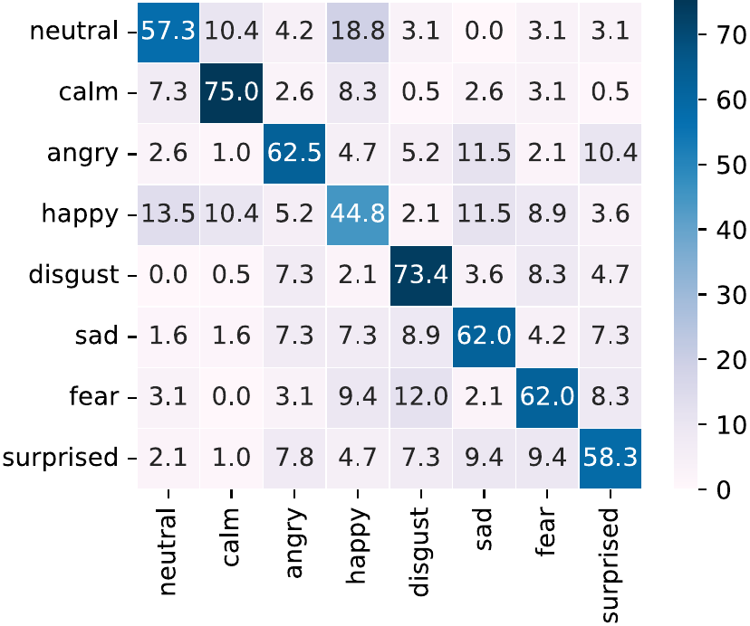
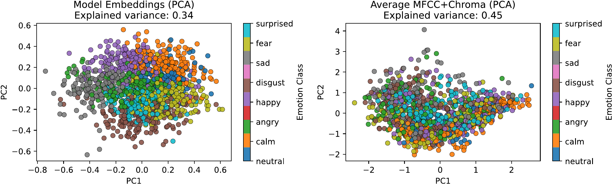

# ResLSTM-SER: Speech Emotion Recognition using Attention-based LSTM-Network with Residual Connection

[](https://ieeexplore.ieee.org/document/11476771)
[](LICENSE)

Official repository for the paper **"Speech Emotion Recognition using Attention-based LSTM-Network with Residual Connection"** by Daniil Krasnoproshin and Maxim Vashkevich, published at the *2026 28th International Conference on Digital Signal Processing and its Applications (DSPA)*.

> **IEEE Xplore:** [https://ieeexplore.ieee.org/document/11476771](https://ieeexplore.ieee.org/document/11476771)

---

## Abstract

Speech emotion recognition is an important component of modern human–computer interaction systems. However, many state-of-the-art approaches rely on large pretrained models with high computational and memory requirements, limiting their applicability. This paper proposes **ResLSTM-SA**, a lightweight architecture that integrates residual connections with soft attention within an LSTM-based framework. Evaluated on the RAVDESS dataset under strict speaker-independent partitioning, the proposed model outperforms conventional attention-based LSTM baselines and several previously reported CNN- and hybrid CNN–LSTM architectures in terms of unweighted average recall (UAR). The best-performing variant (**ResLSTM-SA-h64**) achieves a maximum UAR of **0.6517** with only **46.8k** trainable parameters, delivering competitive accuracy with three orders of magnitude fewer parameters than large-scale self-supervised alternatives, thereby enabling efficient deployment on edge devices and real-time voice assistants.

---

## Repository Structure

```
ResLSTM-SER/
├── train.ipynb                  # Main training notebook (feature extraction + tuning + evaluation)
├── requirements.txt            # Python dependencies
├── README.md                   # This file
├── LICENSE                     # MIT License
├── .gitignore                  # Git ignore rules
│
├── assets/
│   └── figures/                # Figures from the paper (used in this README)
│
├── src/                        # Reusable source modules
│   ├── models/
│   │   ├── res_lstm.py          # ResLSTM_Multi_Att model
│   │   └── __init__.py
│   └── util/
│       ├── nn_evaluation.py    # Ignite-based evaluators
│       ├── random_state.py     # Seed management for reproducibility
│       └── __init__.py
│
├── data/
│   └── ravdess/
│       ├── README.md           # Dataset download instructions & path placeholder
│       └── extracted/          # Extracted features (generated by the notebook)
│
├── results/                    # Experimental results (UAR tables)
│   ├── results_ResLSTM_H32_UAR_stat.txt
│   ├── results_ResLSTM_H64_UAR_stat.txt
│   ├── results_ResLSTM_H128_UAR_stat.txt
│   ├── results_LSTM_H32_UAR_stat.txt
│   ├── results_LSTM_H64_UAR_stat.txt
│   └── results_LSTM_H128_UAR_stat.txt
│
└── slides/                     # Conference presentation slides
    └── DSPA2026_kd_vm.pdf       # See: slides/DSPA2026_kd_vm.pdf
```

---

## Model Architecture

### ResLSTM-SA (Residual LSTM with Soft Attention)

<p align="center">
  
</p>
<p align="center"><em>Scheme of the proposed ResLSTM-SA model.</em></p>

The proposed architecture augments the LSTM-SA baseline with an additional LSTM layer (`LSTM1`) wrapped in a residual (skip) connection. `LSTM1` enriches the temporal representation of the input features before they are processed by the main attention-based `LSTM2`:

- **`LSTM1` (46 → 46)** — Xavier init, forget-gate bias = 1; output added to the input via a skip connection (`Σ`).
- **BatchNorm1d(46)** — normalizes the fused representation.
- **`LSTM2` (46 → H)** — `H ∈ {32, 64, 128}`.
- **Soft Attention** — `α_t = softmax(uᵀ·h_t)`, context `h_context = Σ α_t·h_t`.
- **BatchNorm1d(H) → Dropout → Linear(H → 8) → Softmax** — 8-class emotion output.

**Key design choice:** `LSTM1` preserves the input dimensionality (`d=46`), enabling additive residual fusion of raw features with contextually enriched representations before passing them to the attention-based `LSTM2`.

The figure below visualizes the input feature sequence and intermediate activations of the trained **ResLSTM-SA-h64**. `LSTM1` produces contextually enriched representations that are added to the original input via the residual connection, while the attention mechanism concentrates on salient temporal regions (around frames 40 and 60) corresponding to emotionally expressive segments.

<p align="center">
  
</p>
<p align="center"><em>Visualization of signal flow in ResLSTM-SA-h64.</em></p>

### Baseline: LSTM-SA

The single-LSTM baseline with soft attention from [Mirsamadi & Barsoum (2017)](https://arxiv.org/abs/1708.03947).

---

## Feature Extraction

The speech signal is parameterized with a 34-dimensional MFCC vector and a 12-dimensional chromagram per frame, concatenated into a 46-dimensional joint representation `X ∈ R^(T×46)` that serves as input to the recurrent network.

<p align="center">
  
</p>
<p align="center"><em>Feature extraction process (MFCC + chroma → 46-dim sequence).</em></p>

---

## Key Results (RAVDESS, 8 emotions, speaker-independent 5-fold CV)

| Model | Hidden Size | Trainable Params | UAR (mean ± std) | Max UAR |
|-------|-------------|-------------------|----------------------|---------|
| **ResLSTM-SA-h64** | 64 | **46,772** | 0.6232 ± 0.0119 | **0.6517** |
| ResLSTM-SA-h128 | 128 | 108,916 | 0.6107 ± 0.0134 | 0.6348 |
| ResLSTM-SA-h32 | 32 | 27,988 | 0.6130 ± 0.0111 | 0.6315 |

*Results reported over 10 independent runs with Optuna-optimized hyperparameters. UAR = Unweighted Average Recall.*

Incorporating residual connections consistently improves UAR over the LSTM-SA baseline across all capacities (gains of up to 7.7 percentage points). `ResLSTM-SA-h32` (28.0k params) even outperforms the much larger `LSTM-SA-h128` (91.6k params).

### Confusion Matrix (ResLSTM-SA-h64)

<p align="center">
  
</p>

*`happy` shows the lowest class-wise recall (44.8%), mostly confused with `neutral`; conversely 18.8% of `neutral` utterances are misclassified as `happy` — a systematic confusability between these affective states.*

### Embedding Space (PCA)

<p align="center">
  
</p>

*PCA projections of (a) `ResLSTM-SA-h64` utterance-level embeddings and (b) averaged MFCC+Chroma features. The learned embeddings form compact, well-separated clusters, whereas raw features overlap heavily — demonstrating the model's ability to encode emotion-discriminative structure.*

### Comparison with State-of-the-Art (RAVDESS)

| Model | #Params | UAR |
|-------|---------|-----|
| AlexNet embeddings + SVM | 61.0 M | 0.4580 |
| CNN+LSTM | — | 0.5671 |
| GResNet+S | — | 0.5970 |
| Fine-tuned AlexNet | 61.0 M | 0.6167 |
| **ResLSTM-SA-h64 (proposed)** | **0.05 M** | **0.6517** |
| Fine-tuned CNN14 | 81.0 M | 0.7658 |
| Fine-tuned xlsr-wav2vec 2.0 | 317.0 M | 0.8182 |
| wav2vec 2.0 + data augmentation | 317.0 M | 0.8229 |

*ResLSTM-SA-h64 surpasses all non–self-supervised approaches while using **three orders of magnitude fewer parameters** than fine-tuned CNN/transformer models. See the paper for references.*

---

## Quick Start

### 1. Clone the repository

```bash
git clone https://github.com/Mak-Sim/ResLSTM-SER.git
cd ResLSTM-SER
```

### 2. Install dependencies

```bash
pip install -r requirements.txt
```

> **Note:** PyTorch installation varies by system. See [pytorch.org](https://pytorch.org) for platform-specific instructions.

### 3. Download the RAVDESS dataset

The RAVDESS dataset is **not** included in this repository. Download the *"Audio_Speech_Actors_01-24.zip"* from one of these sources:

- [Kaggle: RAVDESS Emotional Speech Audio](https://www.kaggle.com/datasets/uwrfkaggler/ravdess-emotional-speech-audio)
- [Zenodo (official)](https://zenodo.org/record/1188976)

Extract the archive so that the structure matches:

```
data/ravdess/audio_speech_actors_01-24/
├── Actor_01/
│   ├── 03-01-01-01-01-01-01.wav
│   └── ...
├── Actor_02/
│   └── ...
└── Actor_24/
    └── ...
```

Alternatively, specify a custom path by editing `RAVDESS_DATA_PATH` in the notebook.

### 4. Run the notebook

```bash
jupyter notebook train.ipynb
```

**Notebook sections:**
1. Imports & Path Configuration
2. Feature Extraction (two-pass global normalization)
3. PyTorch Dataset
4. Model Definitions (ResLSTM-SA + LSTM-SA baseline)
5. Training Loop & K-Fold CV
6. Optuna Hyperparameter Optimization
7. 10-Run Statistical Evaluation

Adjust `HIDDEN_SIZE` (32, 64, or 128) and `N_TRIALS` as needed.

---

## Reproducibility

This repository follows best practices for reproducible ML research:

1. **Deterministic seeding**: All random number generators (Python `random`, NumPy, PyTorch) are seeded consistently across runs. Use `set_seed(42)` at the start of any experiment.
2. **Fixed data splits**: Speaker-independent 5-fold cross-validation splits are hardcoded to match those used in the paper.
3. **Hyperparameter search**: Optuna with Tree-Structured Parzen Estimator (TPE) sampler — the same framework used in the paper.
4. **Statistical evaluation**: 10 independent runs with distinct random seeds, reporting mean ± standard deviation of UAR.
5. **Two-pass feature normalization**: Global mean/std are computed over the entire dataset in the first pass, then applied in the second pass — exactly as described in the paper.

### Feature Extraction Parameters

| Parameter | Value | Description |
|-----------|-------|-------------|
| `n_mfcc` | 34 | Number of MFCC coefficients |
| `n_chroma` | 12 | Chroma bins (pitch classes) |
| `n_fft` | 4096 | FFT window size |
| `hop_length` | 2048 | Hop size (n_fft // 2) |
| `input_dim` | 46 | Concatenated MFCC + Chroma |

### Hyperparameter Search Space

| Parameter | Range | Sampling |
|-----------|-------|----------|
| Learning rate | [3×10⁻⁵, 2×10⁻⁴] | Log-uniform |
| Weight decay | [2×10⁻⁵, 2×10⁻²] | Log-uniform |
| Dropout | [0.1, 0.5] | Uniform |
| T₀ (cosine annealing) | {1, 2, 3, 5, 10} | Categorical |
| Batch size | {8, 16, 32, 64} | Categorical |

### Training Configuration

| Parameter | Value |
|-----------|-------|
| Optimizer | Adam |
| LR Scheduler | CosineAnnealingWarmRestarts |
| Loss | Categorical Cross-Entropy |
| Epochs | 100 |
| K-Folds | 5 (speaker-independent) |
| Weight Init | Xavier normal + forget gate bias = 1 |

---

## Citation

If you use this code or the ResLSTM-SA architecture in your research, please cite our paper:

```bibtex
@inproceedings{krasnoproshin2026speech,
  title={Speech Emotion Recognition using Attention-based LSTM-Network with Residual Connection},
  author={Krasnoproshin, Daniil and Vashkevich, Maxim},
  booktitle={2026 28th International Conference on Digital Signal Processing and its Applications (DSPA)},
  year={2026},
  organization={IEEE},
  url={https://ieeexplore.ieee.org/document/11476771}
}
```

### References

- Mirsamadi, S., Barsoum, E., & Zhang, C. (2017). *Automatic speech emotion recognition using recurrent neural networks with local attention.* ICASSP 2017.
- Livingstone, S. R., & Russo, F. A. (2018). *The Ryerson Audio-Visual Database of Emotional Speech and Song (RAVDESS).* PLoS ONE.
- Akiba, T., Sano, S., Yanase, T., Ohta, T., & Koyama, M. (2019). *Optuna: A Next-generation Hyperparameter Optimization Framework.* KDD 2019.

---

## License

This project is licensed under the MIT License — see the [LICENSE](LICENSE) file for details.

---

## Contact

For questions or collaboration:

- **Daniil Krasnoproshin** — daniil.krasnoproshin@gmail.com
- **Maxim Vashkevich** — vashkevich@bsuir.by

*Belarusian State University of Informatics and Radioelectronics, Minsk, Belarus*
